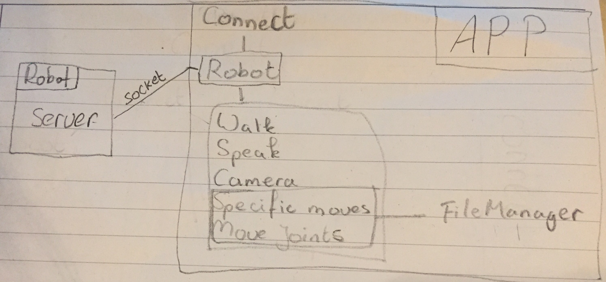

# Design Document NAO Pilot
Caitlin Lagrand  
UvA Programmeerproject application January 2017.

##a diagram of modules or classes that you’ve decided to implement, in appropriate detail and advanced sketches of your UI that clearly explain which features are connected to which underlying part of the code
Connect Activity: ask for IP and connect button, when connected show robot information like name and battery status and volume. 
Speak Activity: input what to say and speak settings like voice and speed.  
Walk Activity: arrows in which way to move or turn. Maybe joystick. Slider for speed.  
Camera Activity: camera image from the selected camera and save button to save either on the robot or on the phone.  
Specific moves Activity: buttons or images with the specific move. Add new specific moves (go to move joints activity).  
Move joints Activity: sliders to move specific joints and save button.  
Robot Class: Connect, Speak, Walk, Camera, Move, Joints  
FileManager Class: Read and write files  
Server on robot script: create a server (socket) and react to messages from the app.  

##a list of APIs and frameworks or plugins that you will be using to provide functionality in your app
~~NaoQi Java SDK (http://doc.aldebaran.com/2-1/dev/java/index_java.html)~~ 
Socket (https://docs.oracle.com/javase/7/docs/api/java/net/Socket.html & https://docs.python.org/2/library/socket.html)  
NaoQi Python SDK (http://doc.aldebaran.com/2-1/dev/python/install_guide.html)  

##a list of data sources if you will get data from an external source
External specific moves files (probably keyframes).

##a list of database tables and fields (and their types) if you will use a database
Not applicable
